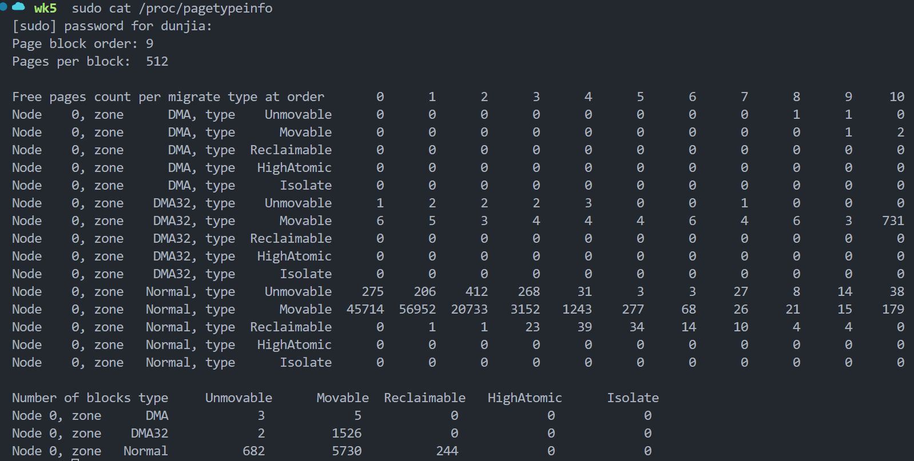

## how to compute DMA32 zone Movable size(KB) in Linux
```bash
$ cat /proc/buddyinfo
```

each order page size = 4KB * 2^order
each order total size = page count * page size

e.g.
```bash
Node 0, zone DMA32, type Movable
Order    0:    100   # 4KB × 100 = 400KB
Order    1:     50   # 8KB × 50 = 400KB
Order    2:     25   # 16KB × 25 = 400KB
...
```

## how to compute the free memory size in Linux

for each zone(DMA, DMA32, Normal):
    for every type(Unmovable, Movable, Reclaimable) page:
        compute the total size of each order page size
then sum them up.

summary:

zone_free_memory = $\sum_{}(Unmovable + Movable + Reclaimable)$

total_free_memory = $\sum_{}(DMA + DMA32 + Normal)$


```bash
$ cat /proc/vmstat | grep MemFree
```

```bash
$ free -h
```